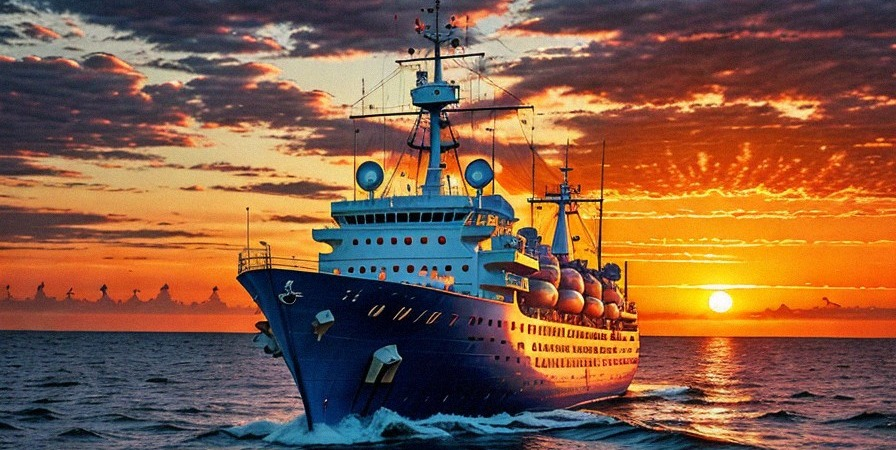

# HackNJIT 2023: ⛵ The Great Nautica ⛵

## **Project:** *OceanMan* (To Be Changed)
#### *Please keep in mind throughout our project we shall be usin' pirate speak*
### *Project Focus:*
#### Makin' an app through react wit' a back end that provides data wit' wha' be available on the ship fer the crew. This includes; Grub, Ship Information, 'n Crew Vitality information.

## ***Sea Charts:***
### Material Database:
* Grub 'n other supplies
### Crewmate Database:
* Blood Pressure, Height, Weight, Pysician, Time of Measure
### Possible Additions (T' be worked on last):
* Crew information portal
* 404 Page

## ***The Ship Crew***

* [Allan Rozario](https://github.com/AllanRoz) - Back End
* [Conor Fitzpatrick](https://github.com/CojoFitz) - Front End
* [Daniel Paglia](https://github.com/dp948) - Front End
* [Noah Jacobson](https://github.com/noahajac) - Back End

## ***APIs Plundered:*** (Apis Used)
* [Google Cloud](https://cloud.google.com/?hl=en)
* [GitHub](github.com)
## ***Libraries Plundered:***
###### (Libraries Used)
* [PHP Router](https://phprouter.com)
## ***Packages Plundered:*** (Packages Used)
* [Styled Components](https://styled-components.com)
## ***Other Plundered Sources*** (Sources Used)
* [AI Image Generation](https://neural.love/ai-art-generator)
* [One Piece Logo](https://1000logos.net/one-piece-logo/)
* [w3schools](https://www.w3schools.com)